# Microsoft 💞s Django!
Resources for Djangonauts and Pythonistas working with VS Code and deploying to Azure.  

> ## WIN A ~~PAIR OF SOCKS~~ $100 AZURE CREDIT!
>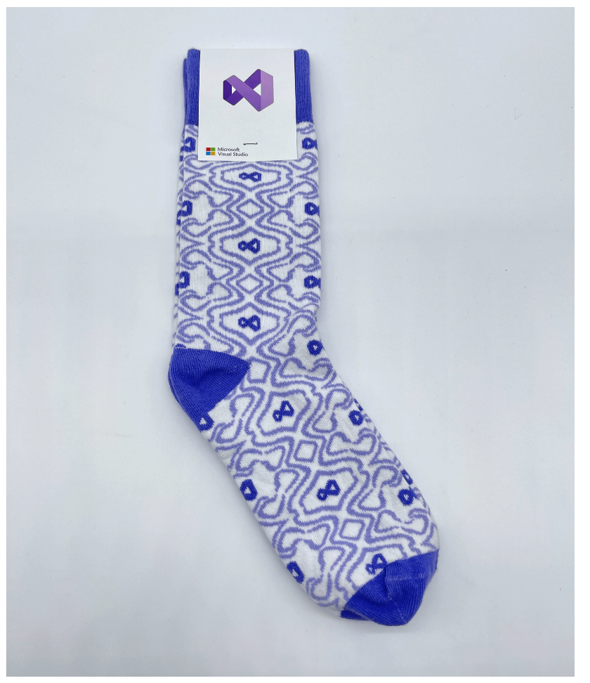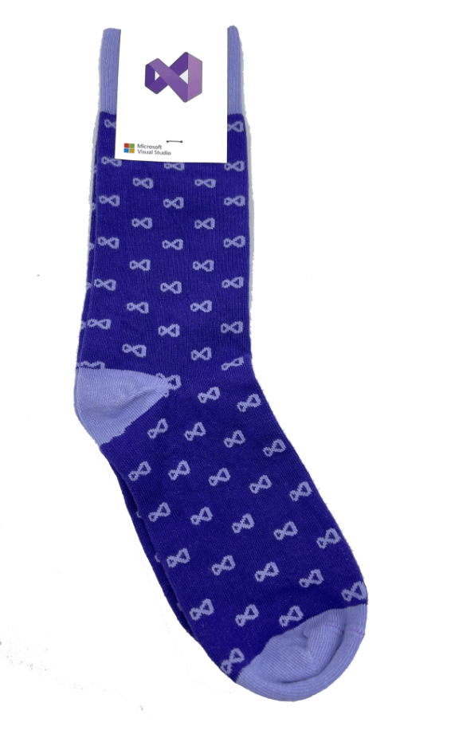
> (sold out)
>
>**Option 1**: Complete [Python on Azure - Azure Fundamentals - Cloud Skills Challenge](https://learn.microsoft.com/en-us/training/challenges?id=930e3b2c-be21-48bf-9079-6c6b7193b616)
>
>**Option 2**: Deploy a Django App to Azure with Azure Free Tier! [https://github.com/Azure-Samples/](https://github.com/Azure-Samples/)
>
>**Option 3**: Complete this [form](https://forms.office.com/r/WHPk61WheE)! 

## Learning

| | |  |
|---  | ---  | -----|
| <a href="https://aka.ms/PythonCodespaces4Teachers">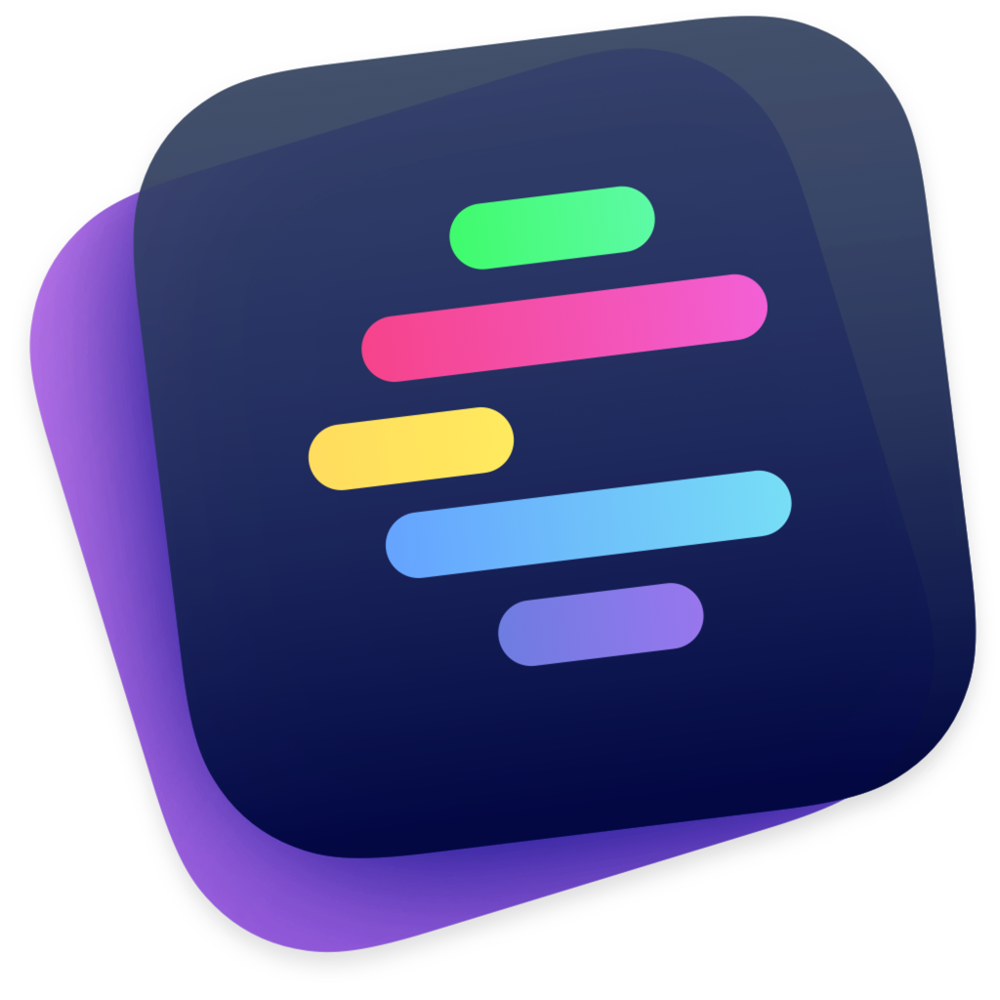  Python Codespaces for Teachers</a> | <a href="https://aka.ms/PythonCodespaces4Students">  Python Codespaces for Students</a>     | <a href="https://code.visualstudio.com/docs/languages/python">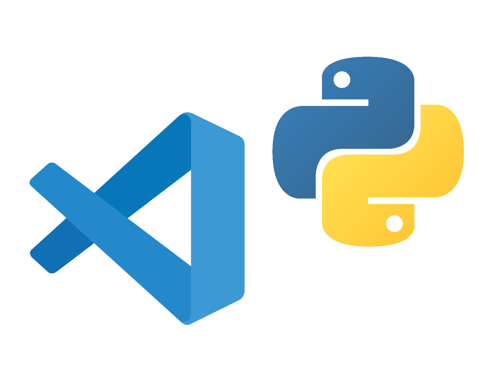  VS Code + Python Tutorial</a>        |
| <a href="https://learn.microsoft.com/en-us/azure/app-service/configure-language-python">  Microsoft Learn - Python Azure App Service</a>  | <a href="https://learn.microsoft.com/en-us/azure/postgresql/flexible-server/tutorial-django-app-service-postgres?tabs=clone">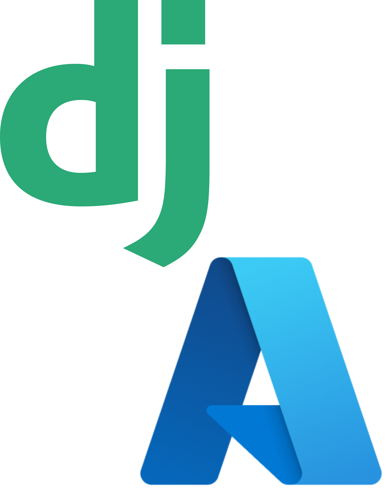  Microsoft Learn - Tutorial Django + Postgresql Azure App Service</a> |<a href="https://learn.microsoft.com/en-us/azure/app-service/quickstart-python?tabs=flask%2Cwindows%2Cazure-cli%2Cvscode-deploy%2Cdeploy-instructions-azportal%2Cterminal-bash%2Cdeploy-instructions-zip-azcli">  Microsoft Learn - Deploy Django or Flask on App Service</a>  |
| <a href="https://learn.microsoft.com/en-us/azure/?product=popular">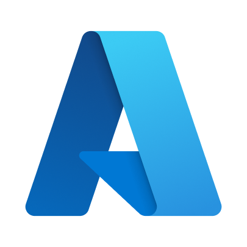  Microsoft Learn - Azure</a>   | <a href="https://learn.microsoft.com/en-us/training/browse/?resource_type=module&terms=Python">  Microsoft Learn - Python</a>  | <a href="https://learn.microsoft.com/en-us/azure/postgresql/">  Microsoft Learn - Postgresql + Azure</a>       |
| <a href="https://github.com/tonybaloney/django-on-azure">  Pycon 2022 Workshop - Django on Azure</a>  | <a href="https://microsoft.github.io/vscode-website-videos/wsl-windows/wsl-with-python-in-vs-code/">  Watch Tutorial Video WSL + VS Code + Python</a>      |

> ## 📣 Opportunity for An Open Source Project
>**💡 Help maintain a Python extension or create your own**
> _approx 5-10 hours per month depending on experience_
>
> If you’re interested in contributing and maintaining efforts, the VS Code team could use the continued support in the Python community for [vscode-pylint](https://github.com/microsoft/vscode-pylint/labels/good%20first%20issue), [vscode-flake8](https://github.com/microsoft/vscode-flake8/labels/good%20first%20issue), [vscode-isort](https://github.com/microsoft/vscode-isort/labels/good%20first%20issue), and [vscode-black-formatter](https://github.com/microsoft/vscode-black-formatter/labels/good%20first%20issue) which are VS Code integrations for Pylint, Flake8, isort and Black respectively or [create a Python extension for VS Code](https://github.com/microsoft/vscode-python-tools-extension-template). You may even get featured in a blog post or invited to a Python community stream with Microsoft! **Open an issue and chat with the VS Code team for more information.**
>
>**💡 Create an AZD template** _approx 20 hours total depending on experience_
>
>Check out [aka.ms/awesome-azd](aka.ms/awesome-azd) -- the community-contributed templates gallery! If you're interested in how to contribute check out [Anthony Shaw's template for Django on Azure](https://github.com/tonybaloney/django-on-azure). If you contribute a Django template, your work could end up [here](https://azure.github.io/awesome-azd/?tags=django). You could also get featured in a blog post or invited to a Python community stream with Microsoft!

## Connect with us!

| | |  |
|---  | ---  | -----|
| <a href="https://aka.ms/PythonCodespaces4Teachers">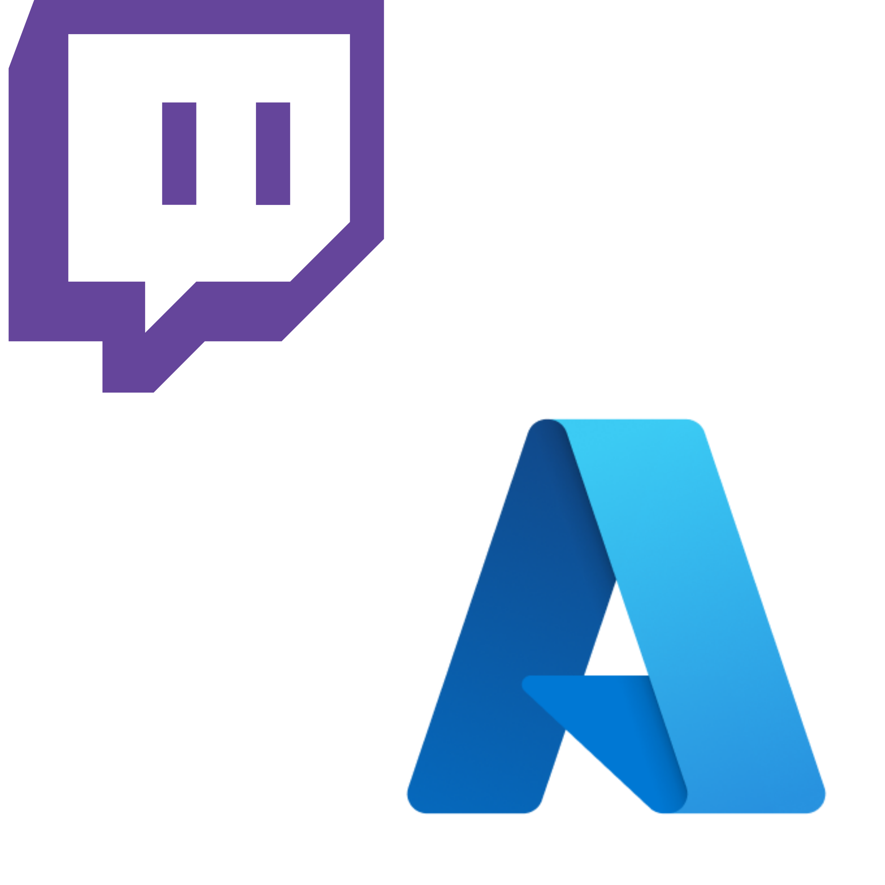  Live Stream with Azure Developer Advocates</a> | <a href="https://aka.ms/python-discord">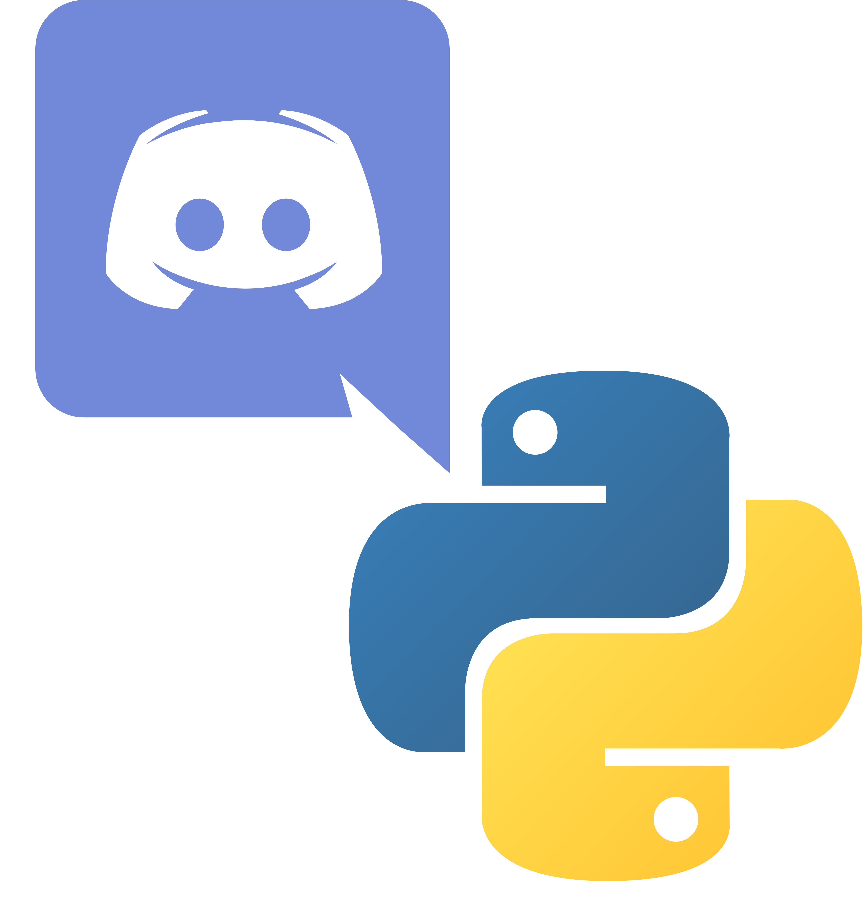  Python Discord @ Microsoft</a> | <a href="https://code.visualstudio.com/docs/languages/python">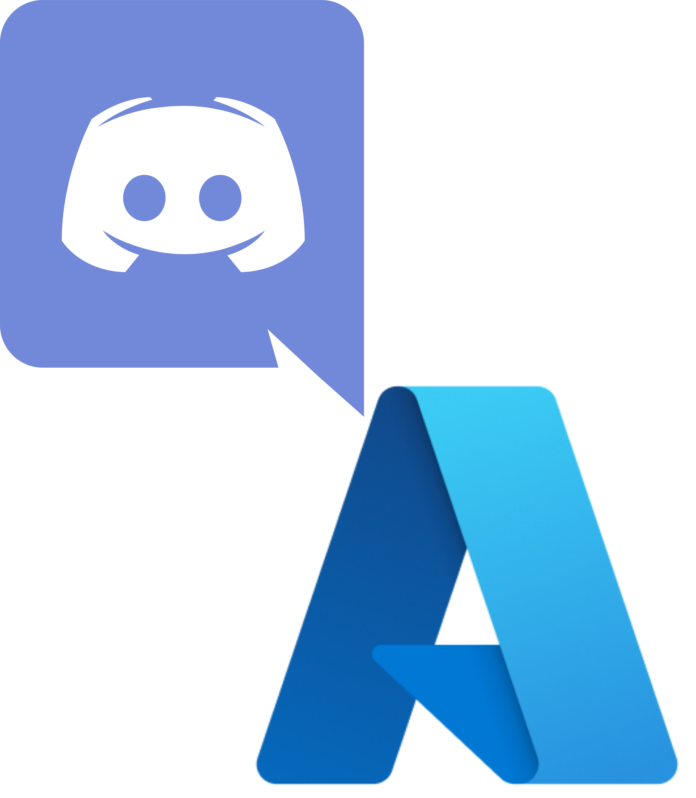  Azure Discord @ Microsoft</a>        |
|<a href="https://aka.ms/PythonCodespaces4Teachers">  AZD October Release Notes</a> <a href="https://github.com/Azure/azure-sdk-for-python/releases">Azure SDK for Python Releases</a>  | <a href="https://code.visualstudio.com/livestream">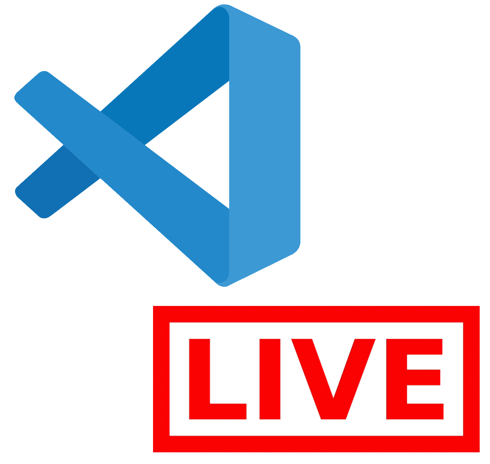  VS Code Release Live Streams</a> | <a href="https://techcommunity.microsoft.com/t5/azure/ct-p/Azuree">  Azure Tech Community</a>        |

<a href="https://azure.microsoft.com/en-us/free/">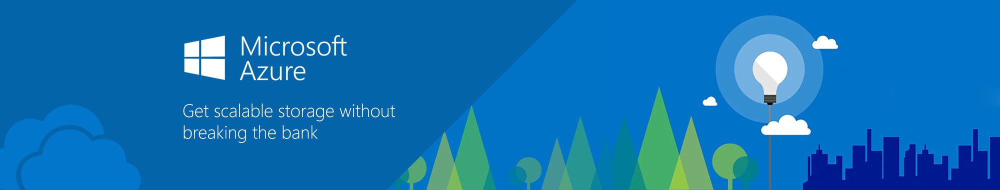  Start with Microsoft Azure Free</a> 

# Hacktoberfest
[https://learn.microsoft.com/en-us/contribute/hacktoberfest](https://learn.microsoft.com/en-us/contribute/hacktoberfest)

[https://devblogs.microsoft.com/python/python-hacktoberfest-2022/](https://devblogs.microsoft.com/python/python-hacktoberfest-2022/)

----
*This repo is continuously updated with Python and Django Resources on Azure, VS Code, WSL and other Microsoft products. For questions reach out create an issue.*